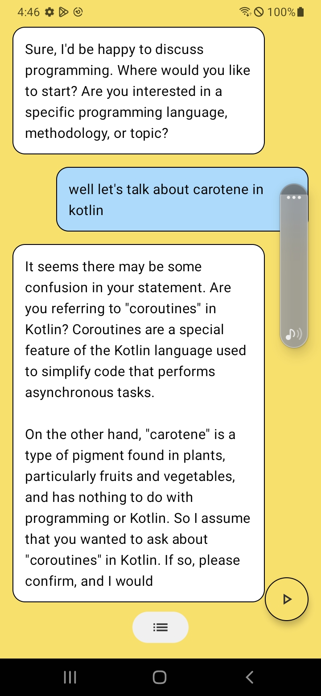

# EnglishBuddy

## Installation
Clone this repository and import into **Android Studio**
```bash
git clone https://github.com/morishjs/EnglishBuddy.git
```

## Configuration
### OpenAI API Key
1. You need to get OpenAI API Key. Please refer to [this page](https://platform.openai.com/account/api-keys) to get the key.
2. Create `local.properties` file in the root directory of the project.
3. Add the following line to `local.properties` file.
```
OPENAI_API_KEY=<YOUR_API_KEY>
```


## Description
This is a simple English learning app. It is a mobile application that allows users to talk with ai and learn English.

## Features
- [x] User can talk with ai
- [x] User can learn English
- [x] User can see the history of conversations

## Tech Stack
- Android Compose
- Kotlin
- Dagger Hilt
- MVVM
- Clean Architecture
- Coroutines
- Retrofit
- Room
- OpenAI

## Screenshots

